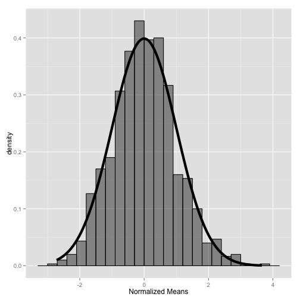

##Overview

The goal of this project was to analyze via simulation and explanation the distribution of averages of fourty random [exponentials](http://en.wikipedia.org/wiki/Exponential_distribution). To do this we ran one thousand simulations of 40 random exponentials, for all trials lamba, the rate parameter, was set to 0.2. We were able to show that the distribution of the averages of these simulations approached the theoretical mean with variance similar to the theoretical variance.

##Simulation
We first set the seed to guarantee consistent results for other researchers. Then we calculate and record the known population parameters for the exponential distribution.

After this, we simulate our thousand trials of 40 random exponentials. Then calculate the relevant variance, standard deviation, and compute several properties relate to the mean.


```r
library('ggplot2')
set.seed(12)
pop.mean <- 1/0.2
pop.sd <- 1/0.2
pop.var <- pop.sd^2
true.sd.sample = pop.sd/sqrt(40)
true.var.sample = true.sd.sample^2

mns = NULL
for (i in 1 : 1000) mns = c(mns, mean(rexp(40,0.2)))
sampleMin <- min(mns)
sampleMax <- max(mns)
sampleMean <- mean(mns)
sampleSd <- sd(mns)
sampleVar <- var(mns)
```

###Mean

The theoretical mean of our function was **5**. We ran 1000 trials taking the mean of each of the 40 random exponential data points. While the minimum value and maximum values for the mean of our 40 random exponents were 2.850691 and 7.890447 respectively, the mean of our sample of 1000 trials of 40 random exponents was **5.0100152** which is extremely close to the population mean of **5**. This is what we'd expect as the Law of Large Numbers states that the sample mean of iid samples is consistent with the population mean.

We can see this mean by looking at a histogram of our averages. The mean of our sample is shown in blue. The theoretical mean is shown in red.


```r
hist(mns, breaks=30, xlab="Means", main="Histogram of 1000 Means of 40 Random Exponentials")
abline(v=sampleMean, col="blue", lwd=2)
abline(v=pop.mean, col="red", lwd=2)
```

 

##Variance

The true standard deviation of our sample is **0.7905694** which is our standard deviation (5) divided by the square root of the number of observations in each of our trials (40). Similarly, the theoretical variance is **0.625**.We can compare these to our calculated values from our random trials which are **standard deviation: 0.7740594** and **variance: 0.599168**. This is exactly what we'd expect as the variability of our thousand trials will approximate that of the true standard deviation of the sample mean.

##Distribution

To see whether the distribution is approximately normal we first normalized the data by subtracting each of our 1000 means from the theoretical mean and then dividing by the population standard deviation divided by the square root of the sample size(40) i.e. (mean - mu)/(sigma/sqrt(40)). As we can tell from the below plot the distribution is roughly normal. This is despite the fact that the underlying data is not normal but exponential. This is consistent with the Central Limit Theorem which states that even for underlying distributions that are not normal the distributions of their averages will be normal.


```r
mnsNorm <- sqrt(40)*(mns - pop.mean)/(pop.sd)
q <- ggplot(data.frame(mnsNorm),aes(x=mnsNorm)) + geom_histogram(alpha = .50, colour = "black",binwidth=.3,aes(y = ..density..)) + xlab("Normalized Means")
q <- q + stat_function(fun = dnorm, size = 2)
q
```

 
